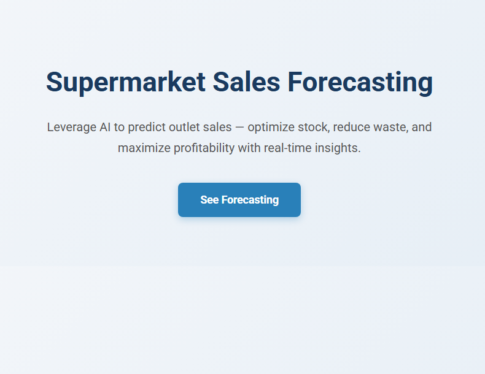
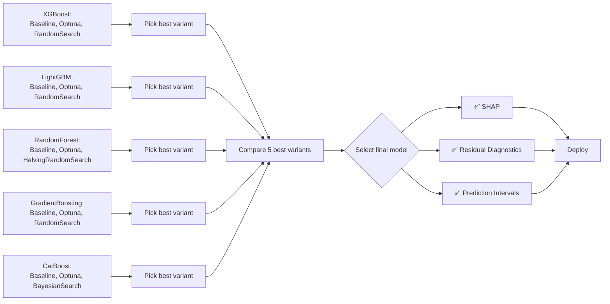
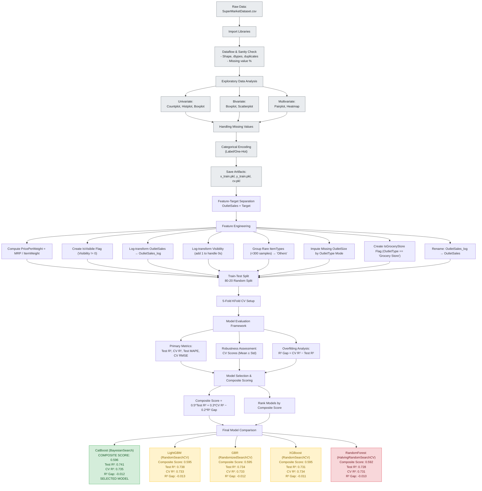
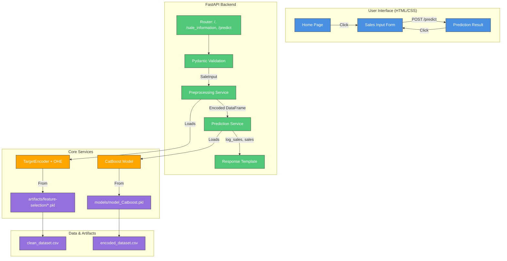

# Super Market Sales Forecasting

> **Predicting Retail Sales with Advanced Machine Learning Models**




[]() []() []() []() []() []() []() []() []() []() []() []() []() []() []() []()


## 📋 Table of Contents

- [Overview](#overview)
- [Features](#features)
- [Dataset](#dataset)
  - [Dataset Description](#dataset-description)
  - [Data Preprocessing](#data-preprocessing)
  - [Libraries Description](#libraries-description)
- [Modeling Pipelne](#modeling-pipeline)
  - [Model Development](#model-development)
  - [Overall Model Overview](#overall-model-overview)
  - [Best Performing Model](#best-model-performance)
- [File Structure](#file-structure)
- [Dependencies](#dependencies)
- [Installation](#installation)
- [System Architecture](#system-architecture)
  - [Flowchart](#flowchart)
  - [Data Flow](#data-flow)
- [Model Interpretability](#model-interpretability)
- [Deployment](#deployment)
- [Future Enhancement](#future-enhancement)
- [Contribution](#contributing)
- [Contact](#contact)
- [License](#license)

---

## Overview

Super Market Sales Forecasting is a data-driven project designed to predict future sales performance using historical sales data, seasonal trends, and customer purchasing patterns. By leveraging machine learning and statistical analysis, the system helps businesses anticipate demand, optimize inventory, plan promotions, and make informed decisions to boost profitability and operational efficiency.

---

## Dataset

### Dataset Description
This dataset captures comprehensive retail sales data from multiple outlets, combining both product-level and outlet-level characteristics to understand sales patterns and performance.<br>

**Key Highlights:**

- Contains detailed information on individual products such as weight, fat content, visibility, and MRP.
- Includes outlet-specific attributes like size, location type, and establishment year.
- Enables sales trend analysis, performance comparison, and predictive modeling across different retail formats.
- The target variable, OutletSales, represents the total sales generated by each outlet.

> Download [BigMart Sales Dataset](https://www.kaggle.com/datasets/brijbhushannanda1979/bigmart-sales-data) from `kaggle` 

The dataset contains the features as follows:
| **Feature Name**            | **Description**                                                                                                                                        |
| --------------------------- | ------------------------------------------------------------------------------------------------------------------------------------------------------ |
| **ItemWeight**              | Weight of the individual product item. Helps understand product characteristics and can influence sales or logistics.                                  |
| **FatContent**              | Indicates whether the item is low fat, regular fat, or another type. Useful for analyzing consumer preferences based on health awareness.              |
| **Visibility**              | The percentage of total display area allocated to the particular product in all stores. Represents how prominently the item is displayed to customers. |
| **ItemType**                | Category of the product (e.g., Dairy, Snacks, Beverages). Helps identify the type of goods being sold and analyze category-wise performance.           |
| **MRP**                     | Maximum Retail Price (in local currency) of the product. Indicates the selling price range and impacts demand.                                         |
| **OutletEstablishmentYear** | Year in which the store or outlet was established. Useful for assessing the outlet’s age and its potential influence on sales.                         |
| **OutletSize**              | Size of the outlet (e.g., Small, Medium, Large). Reflects store capacity and can correlate with sales volume.                                          |
| **LocationType**            | Type of location where the outlet is situated (e.g., Urban, Semiurban, Rural). Helps analyze regional sales differences.                               |
| **OutletType**              | Type of outlet (e.g., Grocery Store, Supermarket Type1, Type2, etc.). Distinguishes between various retail formats for better segmentation.            |
| **OutletSales**             | Total sales generated by the outlet. This is typically the **target variable** in sales prediction models.                                             |


### Data Preprocessing
- **Sanity Check**
  - Remove duplicates
  - check nulls status
  - standardize features

- **Exploratory Data Analysis**
  - ***Univariate Analysis***: `countplot`, `histplot`, `boxplot` are used to check data distribution and outliers detection.
  - ***Bivariate Analysis***: `scatterplot` for numerical relationship, `boxplot` for categorical features vs target features.
  - ***Multivariate Analysis***: `pairplot` for quick overview of numerical relationship, `scatterplot` for feature influences the relationship, grouped bar chart for approval rate combination, `faceted Plot` for multi-dimensional relationships, `heatmap` of correlation matrix.

- **Missing Value Handling**
  - Impute missing values with median by using groupby technique 

- **Feature Engineering**
  - Standardize features names
  - Create new calculative feature

- **Categorical Encoding**
    - Target encoder to avoid high dimensionality of categorical features
    - One-hot-encoding for low cardinality categories


### Libraries Description
| Library | Purpose |
|---------|---------|
| `pandas`, `numpy` | Data manipulation and analysis |
| `scikit-learn` | Model training, evaluation, and preprocessing |
| `lightgbm`, `xgboost` | Gradient boosting models |
| `joblib` | Model persistence |

---

## Modeling Pipelne

**Model Selection Criteria:**

Five ensemble-based regression algorithms were selected due to their strong performance in structured/tabular data and ability to model nonlinear relationships and feature interactions.

The overall modeling workflow involved the following stages:

1. Data Splitting

  - The preprocessed dataset was split into training (80%) and testing (20%) subsets.
  - A time-based split was used to maintain the chronological order of sales data and prevent data leakage.

2. Baseline Model Development

  - Initial models were trained using default hyperparameters to establish a baseline performance score (using metrics such as RMSE and R²).

3. Model Optimization and Hyperparameter Tuning

  - Each model was optimized using two complementary techniques (e.g., Grid Search, Random Search, Bayesian Optimization, or Optuna).
  - Cross-validation (typically 5-fold) was applied to ensure generalization.
  - The best parameter sets were selected based on validation RMSE.

4. Model Evaluation

  - Final models were evaluated on the test set using RMSE, MAE, and R².
  - Feature importance and SHAP analysis were later applied to interpret model behavior.


### Model Development

**Hyperparameter Optimization**


| **Model**                       | **Optimization Techniques**                                         | **Key Hyperparameters Tuned**                                                                                                |
| ------------------------------- | ------------------------------------------------------------------- | ---------------------------------------------------------------------------------------------------------------------------- |
| **Random Forest Regressor**     | 1. Optuna Optimization  <br> 2. HalvingRandomSearchCV                     | `n_estimators`, `max_depth`, `min_samples_split`, `min_samples_leaf`, `max_features`, `bootstrap`                            |
| **XGBoost Regressor**           | 1. RandomizedSearch <br> 2. Optuna Optimization | `n_estimators`, `learning_rate`, `max_depth`, `subsample`, `colsample_bytree`, `reg_alpha`, `reg_lambda`                     |
| **LightGBM Regressor**          | 1. Optuna Optimization <br> 2. Randomized Search CV                 | `num_leaves`, `max_depth`, `learning_rate`, `n_estimators`, `feature_fraction`, `bagging_fraction`, `lambda_l1`, `lambda_l2` |
| **Gradient Boosting Regressor** | 1. Grid Search CV <br> 2. Randomized Search CV                      | `n_estimators`, `learning_rate`, `max_depth`, `min_samples_split`, `min_samples_leaf`, `subsample`                           |
| **CatBoost Regressor**          | 1. Bayesian Optimization <br> 2. Optuna Optimization                | `iterations`, `depth`, `learning_rate`, `l2_leaf_reg`, `bagging_temperature`, `border_count`                                 |

---

**Modeling Flowchart**



**Model Evaluation Framework**
Each model was evaluated using a comprehensive set of metrics:

- Primary Metrics: (CV + Test) MSE, MAE, RMSE, R2 Score, MAPE
- Robustness Assessment: 5-fold cross-validation scores (mean ± std)
- Overfitting Analysis: Gap between CV R2 and Test R2
- Threshold Optimization:  Multiplicative Scaling (MAPE Minimization)

**Model Selection & Composite Scoring**
A composite scoring system was developed to objectively select the best model:
```bash
Composite Score = 0.5 * Test R2 + 0.3 * CV R2 - 0.2 * R2 Gap
```

**Best Model by Compariosn**

| **Comparison Category**                             | **Winner Model**                               |
| --------------------------------------------------- | ---------------------------------------------- |
| Test R² (↑ better)                                  | CatBoost                                       |
| CV R² (↑ better)                                    | CatBoost                                       |
| Test MAPE (%) (↓ better)                            | CatBoost, LightGBM, GBR                        |
| CV RMSE (↓ better)                                  | CatBoost                                       |
| Predicted vs Actual (High Value)                    | CatBoost *(tightest clustering near diagonal)* |
| CV R² vs Test R² (Overfitting Indicator)            | RandomForest *(smallest gap)*                  |
| Cross-Validation Robustness (Mean ± Std)            | CatBoost *(highest mean, lowest std)*          |
| Overfitting Analysis (Generalization Indicator)     | LightGBM *(low overfitting, smallest R² gap)*  |
| Test MAPE (Balanced Performance Metric)             | CatBoost, LightGBM, GBR *(all 5.89%)*          |
| Composite Score Ranking (Final)                     | **CatBoost (0.596)**                           |

This weighted approach prioritizes:

- Robustness (Mean ± Std)
- Balanced Performance (Test MAPE)
- Generalization (penalizing overfitting and high variance)

---

**Complete Modeling Process**



---

### Overall Model Overview

**Aggregates evaluation results from all trained models:**

- **CatBoost**
    - Baseline Modeling
    - Optuna Optimization
    - BayesianSearch Optimization
- **Random Forest**
    - Baseline Modeling
    - Optuna Optimization
    - HalvingRandomSearchOptimization
- **LightGBM**
    - Baseline Modeling
    - Optuna Optimization
    - RandomizedSearch Optimization
- **XGBoost**
    - Baseline Modeling
    - Optuna Optimization
    - RandomizedSearch Optimization
- **Gradient Boosting Regressor**
    - Baseline Modeling
    - Optuna Optimization
    - RandomizedSearch Optimization

Among all evaluated models, ***CatBoost (BayesianSearch)*** achieved the highest `Test R² (0.7466)` and lowest `Test MAPE (5.886%)`, demonstrating superior predictive accuracy and business-relevant precision for sales forecasting. It also shows excellent calibration, with minimal `overfitting (R² Gap = -0.012)` and robust cross-validation performance (`CV R² = 0.7345`, `CV RMSE = 0.5222`).

**Close contenders include:**

- ***LightGBM (RandomSearchCV)*** and ***GBR (RandomizedSearchCV)***, tied for second-best `Test R² (0.7458)` and `Test MAPE (5.890%)`, with even lower `overfitting gaps (−0.0127, −0.0124)` and slightly better CV stability.
- ***XGBoost (RandomSearchCV)*** ranks fourth in `Test R² (0.7455)` but achieves the smallest `overfitting gap (−0.0113)` and highest `RMSE Ratio (0.992)`, indicating exceptional generalization and near-identical performance on train and test sets.
- ***RandomForest (HalvingRandomSearchCV)*** shows the lowest `overfitting gap (−0.0100)` and the closest to perfect generalization, though its `Test R² (0.7410)` and `MAPE (5.944%)` are slightly lower.

All top 5 models exhibit `Low` overfitting and `Good` generalization, confirming strong robustness across data splits.

**In contrast:**

- Optuna-tuned variants (***XGBoost - Optuna***, ***CatBoost - Optuna***) consistently underperform their RandomSearch/Bayesian counterparts, with lower Test R² and higher MAPE, suggesting over-regularization or premature pruning.
- No model shows `High` or problematic overfitting, indicating effective hyperparameter tuning and validation strategy.

Thus, **CatBoost (BayesianSearch)** is recommended as the final model, balancing peak accuracy, stability, and interpretability which is ideal for operational deployment in supermarket sales forecasting.

### Best Model Performance

Based on a Test R² score, Test MAPE and overfitting gap, **CatBoost (BayesianSearchCV)** emerged as the superior model:

- `CV MSE`: 0.2727
- `CV MAE`: 0.4029
- `CV RMSE`: 0.5222
- `CV R2`: 0.7345
- `CV MAPE`: 5.847
- `Test MSE`: 0.2675
- `Test MAE`: 0.4
- `Test RMSE`: 0.5172
- `Test R2`: 0.7466
- `Test MAPE`: 5.8857
- `R2 Gap`: -0.0121
- `RMSE Ratio`: 0.9904
- `Overfitting Status`: Low
- `Model Status (Generalization)`: Good
- `Composite Score`: 0.59607

---

## File Structure

```bash
SupermarketSalePrediction/
├── app/                    # FastAPI web application
├── artifacts/              # Encoders, CV splits, performance logs
├── data/                   # Cleaned & encoded datasets
├── models/                 # Trained model binaries (.pkl)
├── notebooks/              # EDA, modeling, optimization
├── visualizations/         # Plots, SHAP, diagnostics
├── utilities.py            # Reusable ML utilities
├── requirements.txt
├── .gitignore
└── README.md
```

---

## Dependencies

```bash
# Core Data Science Libraries
pandas>=1.5.0
numpy>=1.24.0
matplotlib>=3.7.0
seaborn>=0.12.0

# Machine Learning (Scikit-learn & Extensions)
scikit-learn>=1.3.0
scikit-optimize>=0.9.0
category_encoders>=2.8.1

# Gradient Boosting Models
xgboost>=1.7.0
catboost>=1.2.8

# Model Persistence
joblib>=1.3.0

# Model Interpretability
shap>=0.41.0

yellowbrick>=1.5.0

# fastAPI development libraries
fastapi>=0.100.0
uvicorn[standard]>=0.22.0
jinja2>=3.1.2
python-multipart>=0.0.6
```

---

## Installation

### Clone the repository
```bash
git clone https://github.com/tshihab07/Super-Market-Sales-Forecasting.git
```

```bash
cd Super-Market-Sales-Forecasting
```

### Create virtual environment
```bash
python -m venv .venv
source .venv/bin/activate  # Linux/Mac
# .venv\Scripts\activate   # Windows
```

### Install dependencies
```bash
pip install -r requirements.txt
```

### Run the application
```bash
uvicorn app.main:app --reload --port 8000
```

Visit `http://localhost:8000` in your browser.

---

## System Architecture

The Supermarket Sales Forecasting system follows a modular, layered architecture designed for maintainability, scalability, and reproducibility. It separates concerns into distinct layers: Data, Model, API, and Frontend, with strict unidirectional data flow.

**Key Design Principles:**
- **Separation of Concerns:** Preprocessing, modeling, and serving logic are decoupled.
- **Reproducibility:** All preprocessing artifacts (encoders) and models are persisted.
- **Type Safety:** Pydantic ensures input validation; `FastAPI` provides auto-generated OpenAPI docs.
- **Production-Ready:** Supports hot-reloading, error handling, and future extension (e.g., SHAP explanations, monitoring).

### Flowchart



### Data Flow

1. User Interaction
  - User visits / → sees homepage.
  - Clicks “See Forecasting” → redirected to /sale_information.
  - Fills form with user-friendly inputs (e.g., "City", "Small-Format Supermarket").
2. Request Handling (/predict)
  - Form data sent via POST /predict.
  - FastAPI validates inputs using SaleInput Pydantic model.
  - Valid data passed to preprocessing.py.
3. Preprocessing Layer
  - Maps user inputs → internal representations:
    - "City" → "Tier 1"
    - "Small-Format Supermarket" → "Supermarket Type1"
  - Computes derived features (PricePerWeight, IsGroceryStore).
  - Applies saved encoders:
    - TargetEncoder → ItemType (numeric)
    - OneHotEncoder → categorical dummies
  - Ensures exact feature order and int-typed OHE columns (for CatBoost).
4. Prediction Layer
Preprocessed DataFrame fed to CatBoostRegressor.
Log-scale prediction → exponentiated to original sales scale.
Result formatted and returned via Jinja2 template.
5. Response
Rendered HTML page shows predicted sales + “Predict Again” button.

---

## Model Interpretability

- Used **SHAP** to explain predictions and validate domain logic.
- Top drivers: `MRP`, `ItemWeight`, `OutletType` — aligns with retail expertise.
- [View SHAP Summary Plot](./visualizations/shap_summary.png)

---

## Deployment

This forecasting system is deployed on render.com, allowing users to easily input sales details and receive instant prediction through a live web interface. This deployment ensures smooth accessibility, real-time inference, and a production-ready environment for showcasing the model’s performance.

**Live Demo:** [Supermarket Sales Forecasting](https://supermarket-sales-forecasting.onrender.com/)

---

## Future Enhancement

- Time-series extension (prophet, LSTM) for weekly/monthly forecasts
- Uncertainty quantification (prediction intervals)
- Drift detection & automated retraining pipeline
- Dashboard integration (Plotly/Dash)

---

## Contributing

Contributions are welcome! Please feel free to submit a pull request.
- Fork the project.
- Create your feature branch
- Commit changes
- Push
- Open a Pull Request

---

## Contact

E-mail: tushar.shihab13@gmail.com <br>
More Projects: 👉🏿 [Projects](https://github.com/tshihab07?tab=repositories)<br>
LinkedIn: [Tushar Shihab](https://www.linkedin.com/in/tshihab07/)

---

## License

This project is licensed under the [MIT License](LICENSE).
