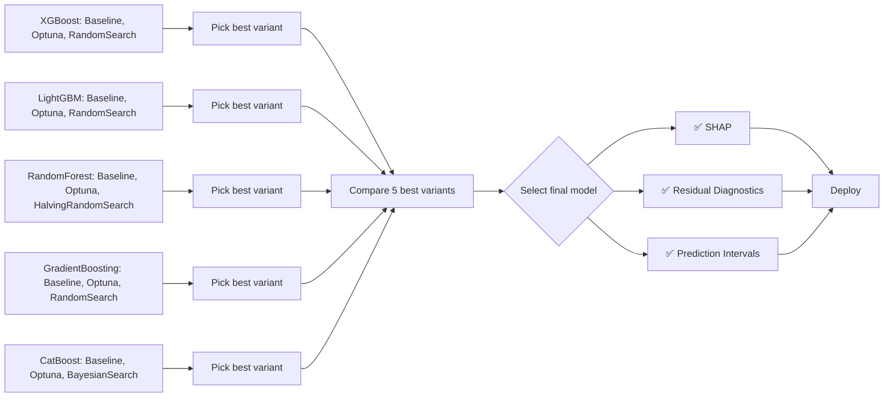
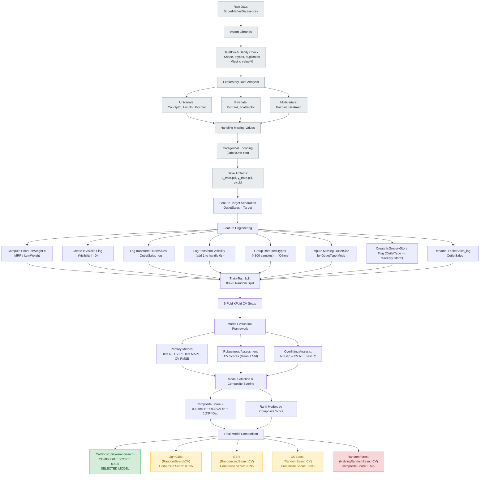

# Super Market Sales Forecasting

## 📋 Table of Contents

- [Overview](#overview)
- [Features](#features)
- [Data Flow](#data-flow)
    - [Dataset Description](#dataset-description)
    - [Data Preprocessing](#data-preprocessing)
    - [Libraries Description](#libraries-description)
- [Modeling Pipelne](#modeling-pipeline)

---

## Overview

Super Market Sales Forecasting is a data-driven project designed to predict future sales performance using historical sales data, seasonal trends, and customer purchasing patterns. By leveraging machine learning and statistical analysis, the system helps businesses anticipate demand, optimize inventory, plan promotions, and make informed decisions to boost profitability and operational efficiency.

---

## Data Flow

### Dataset Description
This dataset captures comprehensive retail sales data from multiple outlets, combining both product-level and outlet-level characteristics to understand sales patterns and performance.<br>

**Key Highlights:**

- Contains detailed information on individual products such as weight, fat content, visibility, and MRP.
- Includes outlet-specific attributes like size, location type, and establishment year.
- Enables sales trend analysis, performance comparison, and predictive modeling across different retail formats.
- The target variable, OutletSales, represents the total sales generated by each outlet.

> Download [BigMart Sales Dataset](https://www.kaggle.com/datasets/brijbhushannanda1979/bigmart-sales-data) from `kaggle` 

The dataset contains the features as follows:
| **Feature Name**            | **Description**                                                                                                                                        |
| --------------------------- | ------------------------------------------------------------------------------------------------------------------------------------------------------ |
| **ItemWeight**              | Weight of the individual product item. Helps understand product characteristics and can influence sales or logistics.                                  |
| **FatContent**              | Indicates whether the item is low fat, regular fat, or another type. Useful for analyzing consumer preferences based on health awareness.              |
| **Visibility**              | The percentage of total display area allocated to the particular product in all stores. Represents how prominently the item is displayed to customers. |
| **ItemType**                | Category of the product (e.g., Dairy, Snacks, Beverages). Helps identify the type of goods being sold and analyze category-wise performance.           |
| **MRP**                     | Maximum Retail Price (in local currency) of the product. Indicates the selling price range and impacts demand.                                         |
| **OutletEstablishmentYear** | Year in which the store or outlet was established. Useful for assessing the outlet’s age and its potential influence on sales.                         |
| **OutletSize**              | Size of the outlet (e.g., Small, Medium, Large). Reflects store capacity and can correlate with sales volume.                                          |
| **LocationType**            | Type of location where the outlet is situated (e.g., Urban, Semiurban, Rural). Helps analyze regional sales differences.                               |
| **OutletType**              | Type of outlet (e.g., Grocery Store, Supermarket Type1, Type2, etc.). Distinguishes between various retail formats for better segmentation.            |
| **OutletSales**             | Total sales generated by the outlet. This is typically the **target variable** in sales prediction models.                                             |


### Data Preprocessing
- **Sanity Check**
  - Remove duplicates
  - check nulls status
  - standardize features

- **Exploratory Data Analysis**
  - ***Univariate Analysis***: `countplot`, `histplot`, `boxplot` are used to check data distribution and outliers detection.
  - ***Bivariate Analysis***: `scatterplot` for numerical relationship, `boxplot` for categorical features vs target features.
  - ***Multivariate Analysis***: `pairplot` for quick overview of numerical relationship, `scatterplot` for feature influences the relationship, grouped bar chart for approval rate combination, `faceted Plot` for multi-dimensional relationships, `heatmap` of correlation matrix.

- **Missing Value Handling**
  - Impute missing values with median by using groupby technique 

- **Feature Engineering**
  - Standardize features names
  - Create new calculative feature

- **Categorical Encoding**
    - Target encoder to avoid high dimensionality of categorical features
    - One-hot-encoding for low cardinality categories


### Libraries Description
| Library | Purpose |
|---------|---------|
| `pandas`, `numpy` | Data manipulation and analysis |
| `scikit-learn` | Model training, evaluation, and preprocessing |
| `lightgbm`, `xgboost` | Gradient boosting models |
| `joblib` | Model persistence |

---

## Modeling Pipelne

**Model Selection Criteria:**

Five ensemble-based regression algorithms were selected due to their strong performance in structured/tabular data and ability to model nonlinear relationships and feature interactions.

The overall modeling workflow involved the following stages:

1. Data Splitting

  - The preprocessed dataset was split into training (80%) and testing (20%) subsets.
  - A time-based split was used to maintain the chronological order of sales data and prevent data leakage.

2. Baseline Model Development

  - Initial models were trained using default hyperparameters to establish a baseline performance score (using metrics such as RMSE and R²).

3. Model Optimization and Hyperparameter Tuning

  - Each model was optimized using two complementary techniques (e.g., Grid Search, Random Search, Bayesian Optimization, or Optuna).
  - Cross-validation (typically 5-fold) was applied to ensure generalization.
  - The best parameter sets were selected based on validation RMSE.

4. Model Evaluation

  - Final models were evaluated on the test set using RMSE, MAE, and R².
  - Feature importance and SHAP analysis were later applied to interpret model behavior.


**Model Development & Hyperparameter Optimization**

| **Model**                       | **Optimization Techniques**                                         | **Key Hyperparameters Tuned**                                                                                                |
| ------------------------------- | ------------------------------------------------------------------- | ---------------------------------------------------------------------------------------------------------------------------- |
| **Random Forest Regressor**     | 1. Optuna Optimization  <br> 2. HalvingRandomSearchCV                     | `n_estimators`, `max_depth`, `min_samples_split`, `min_samples_leaf`, `max_features`, `bootstrap`                            |
| **XGBoost Regressor**           | 1. RandomizedSearch <br> 2. Optuna Optimization | `n_estimators`, `learning_rate`, `max_depth`, `subsample`, `colsample_bytree`, `reg_alpha`, `reg_lambda`                     |
| **LightGBM Regressor**          | 1. Optuna Optimization <br> 2. Randomized Search CV                 | `num_leaves`, `max_depth`, `learning_rate`, `n_estimators`, `feature_fraction`, `bagging_fraction`, `lambda_l1`, `lambda_l2` |
| **Gradient Boosting Regressor** | 1. Grid Search CV <br> 2. Randomized Search CV                      | `n_estimators`, `learning_rate`, `max_depth`, `min_samples_split`, `min_samples_leaf`, `subsample`                           |
| **CatBoost Regressor**          | 1. Bayesian Optimization <br> 2. Optuna Optimization                | `iterations`, `depth`, `learning_rate`, `l2_leaf_reg`, `bagging_temperature`, `border_count`                                 |

**Model Development Workflow**



**Model Evaluation Framework**
Each model was evaluated using a comprehensive set of metrics:

- Primary Metrics: (CV + Test) MSE, MAE, RMSE, R2 Score, MAPE
- Robustness Assessment: 5-fold cross-validation scores (mean ± std)
- Overfitting Analysis: Gap between CV R2 and Test R2
- Threshold Optimization:  Multiplicative Scaling (MAPE Minimization)

**Model Selection & Composite Scoring**
A composite scoring system was developed to objectively select the best model:
```bash
Composite Score = 0.5 * Test R2 + 0.3 * CV R2 - 0.2 * R2 Gap
```

**Best Model by Compariosn**

| **Comparison Category**                             | **Winner Model**                               |
| --------------------------------------------------- | ---------------------------------------------- |
| Test R² (↑ better)                                  | CatBoost                                       |
| CV R² (↑ better)                                    | CatBoost                                       |
| Test MAPE (%) (↓ better)                            | CatBoost, LightGBM, GBR                        |
| CV RMSE (↓ better)                                  | CatBoost                                       |
| Predicted vs Actual (High Value)                    | CatBoost *(tightest clustering near diagonal)* |
| CV R² vs Test R² (Overfitting Indicator)            | RandomForest *(smallest gap)*                  |
| Cross-Validation Robustness (Mean ± Std)            | CatBoost *(highest mean, lowest std)*          |
| Overfitting Analysis (Generalization Indicator)     | LightGBM *(low overfitting, smallest R² gap)*  |
| Test MAPE (Balanced Performance Metric)             | CatBoost, LightGBM, GBR *(all 5.89%)*          |
| Composite Score Ranking (Final)                     | **CatBoost (0.596)**                           |

This weighted approach prioritizes:

- Robustness (Mean ± Std)
- Balanced Performance (Test MAPE)
- Generalization (penalizing overfitting and high variance)

**Modeling Flowchart**



---

**Author**<br>
Tushar Shihab<br>
Machine Learning Engineer
